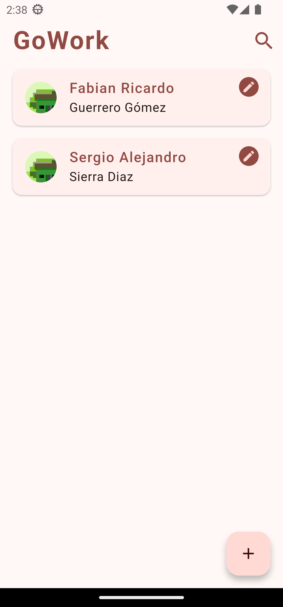
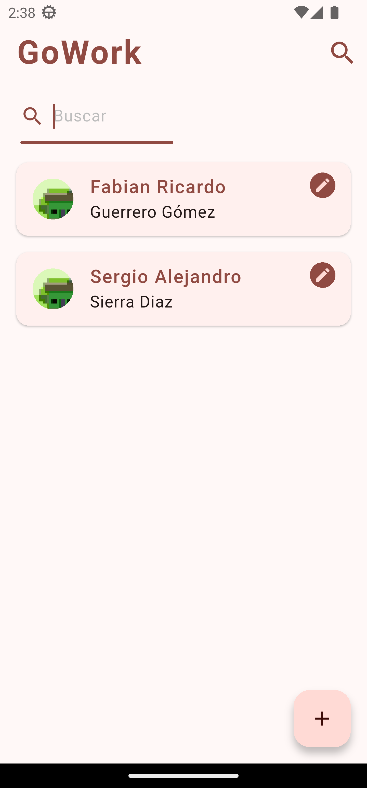
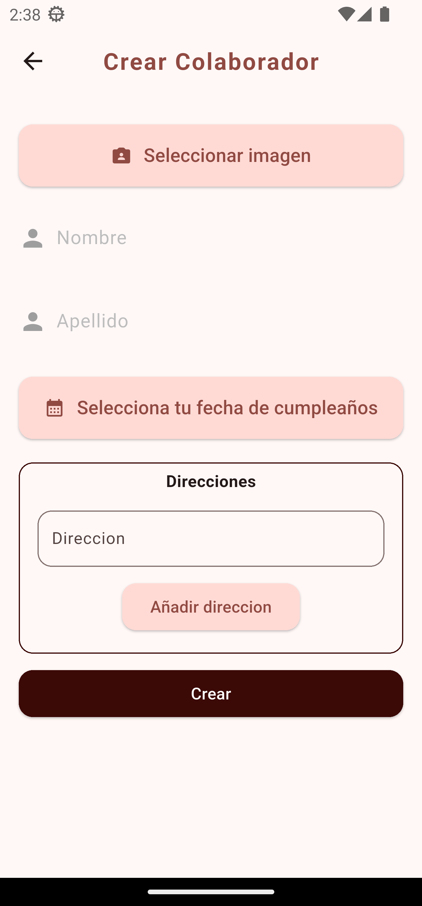
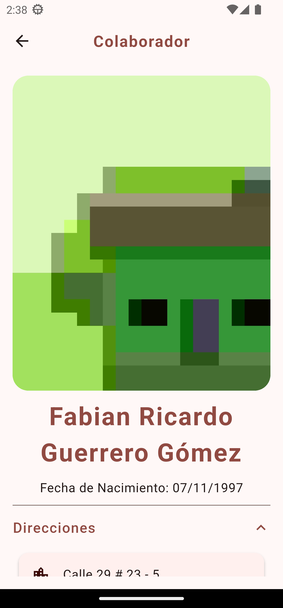
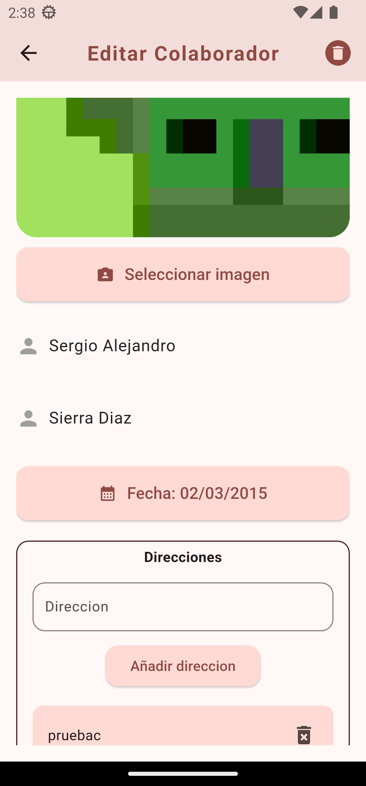

# GoWork - Prueba Técnica Flutter

## 📌 Información General

GoWork es una aplicación móvil desarrollada en Flutter diseñada para facilitar la gestión de colaboradores y la asignación de ubicaciones de trabajo. Esta aplicación está pensada para optimizar la administración de recursos humanos, permitiendo a los administradores asignar ubicaciones de manera eficiente, así como mantener un registro organizado de los colaboradores.

## 📷 Capturas de Pantalla

<table>
  <tr>
    <td>
      
      <p><strong>Lista de Colaboradores</strong></p>
    </td>
    <td>
      
      <p><strong>Búsqueda de Colaboradores</strong></p>
    </td>
  </tr>
  <tr>
    <td>
      
      <p><strong>Crear Nuevo Colaborador</strong></p>
    </td>
    <td>
      
      <p><strong>Detalles del Colaborador</strong></p>
    </td>
  </tr>
  <tr>
    <td>
      
      <p><strong>Editar Colaborador</strong></p>
    </td>
    <td></td> <!-- Celda vacía si el número de imágenes es impar -->
  </tr>
</table>

## 🚀 Instalación y Configuración

### Requisitos previos

- Flutter 3.29.0
- Dart 3.7.0
- Dependencias instaladas con `flutter pub get`

### Instalación

1. Clonar el repositorio:
   ```bash
   git clone https://github.com/frguerrerogo/go_work.git
   cd gowork
   ```
2. Instalar dependencias:
   ```bash
   flutter pub get
   ```
3. Ejecutar la aplicación:
   ```bash
   flutter run
   ```

## 🎮 Uso de la App

### Funcionalidades principales:

1. **Lista de Colaboradores**: Visualiza todos los colaboradores registrados con su información básica.
2. **Perfil del Colaborador**: Consulta detalles de un colaborador.
3. **Crear Colaborador**: Permite registrar un nuevo colaborador con sus datos.
4. **Editar Colaborador**: Permite editar y eliminar un colaborador y todos sus datos.

### Instrucciones de uso:

#### 📋 Lista de Colaboradores
Muestra los colaboradores registrados con información básica.
- Puedes editar con el ícono ✏️.
- Usa 🔍 para buscar colaboradores.
- Presiona ➕ para agregar uno nuevo.

#### ➕ Crear Colaborador
Completa los campos obligatorios:
- **Nombre** (obligatorio)
- **Apellido** (obligatorio)
- **Fecha de nacimiento** (obligatorio)
- **Al menos una dirección** (obligatorio)
- Imagen (opcional)

Presiona **Crear** para guardar.

#### ✏️ Editar Colaborador
- Los datos aparecen precargados para su modificación.
- Presiona **Guardar** para actualizar la información.
- Usa 🗑️ en la esquina superior izquierda para eliminar al colaborador.

#### 👤 Perfil del Colaborador
Muestra la información detallada del colaborador:
- Imagen
- Nombre
- Fecha de nacimiento
- Direcciones en un desplegable

## 📂 Estructura del Código

Este proyecto sigue una arquitectura modular basada en Clean Architecture, separando las capas de presentación, dominio y datos, lo que facilita la escalabilidad y el mantenimiento.

- core/ → Configuraciones generales, inyección de dependencias, temas y utilidades globales.
- data/ → Implementación de fuentes de datos (APIs, SQLite, almacenamiento local) y repositorios concretos.
- domain/ → Definición de entidades, repositorios abstractos y casos de uso.
- presentation/ → UI, lógica de estado con Cubit/Bloc, pantallas y widgets reutilizables.

Esta estructura permite un flujo limpio y desacoplado, facilitando la gestión de cambios y nuevas funcionalidades.

```
lib/
│── main.dart
│── core/                # Configuraciones generales, constantes, adaptadores, temas
│   │── config/
│   │   │── di/
│   │   │   │── dependency_injector.dart
│   │   │   │── dependency_injector.g.dart
│   │   │── router/
│   │   │   │── app_router.dart
│   │   │   │── app_routes.dart
│   │   │   │── screen_builders.dart
│   │   │── app_constants.dart
│   │   │── app_text_styles.dart
│   │   │── app_theme.dart
│   │   │── app_utils.dart
│   │   │── index.dart
│── data/                # Fuentes de datos, modelos y repositorios
│   │── collaborator/
│   │   │── adapters/
│   │   │   │── collaborator_adapter.dart
│   │   │── datasources/
│   │   │   │── collaborator_datasource_impl.dart
│   │   │── models/
│   │   │   │── collaborator_model.dart
│   │   │── repositories/
│   │   │   │── collaborator_repository_impl.dart
│   │── core/
│   │   │── adapter/
│   │   │   │── adapter.dart
│   │   │   │── index.dart
│   │   │── datasources/
│   │   │   │── apis/
│   │   │   │── local/
│   │   │   │   │── sqlite/
│   │   │   │   │   │── app_database.dart
│   │   │   │   │   │── file_storage_impl.dart
│   │   │   │   │   │── index.dart
│   │   │── repositories/
│   │   │   │── index.dart
│── domain/              # Entidades, repositorios abstractos y casos de uso
│   │── collaborator/
│   │   │── datasources/
│   │   │   │── collaborator_datasource.dart
│   │   │── entities/
│   │   │   │── collaborator_entity.dart
│   │   │── repositories/
│   │   │   │── collaborator_repository.dart
│   │── core/
│   │   │── datasources/
│   │   │   │── local/
│   │   │   │   │── file_storage.dart
│   │   │   │   │── index.dart
│   │   │── repositories/
│   │   │   │── index.dart
│── presentation/        # UI, estados (Cubit/Bloc), pantallas, widgets
│   │── collaborator/
│   │   │── create_update/
│   │   │   │── cubit/
│   │   │   │   │── collaborator_create_update_cubit.dart
│   │   │   │   │── collaborator_create_update_state.dart
│   │   │   │── screens/
│   │   │   │   │── collaborator_create_update_screen.dart
│   │   │── home/
│   │   │   │── cubit/
│   │   │   │   │── collaborator_home_cubit.dart
│   │   │   │   │── collaborator_home_state.dart
│   │   │   │── screens/
│   │   │   │   │── collaborator_home_screen.dart
│   │   │── information/
│   │   │   │── cubit/
│   │   │   │   │── collaborator_information_cubit.dart
│   │   │   │   │── collaborator_information_state.dart
│   │   │   │── screens/
│   │   │   │   │── collaborator_information_screen.dart
│   │── core/
│   │   │── utils/
│   │   │   │── cubits/
│   │   │   │   │── index.dart
│   │   │   │── screens/
│   │   │   │   │── index.dart
│   │   │── widgets/
│   │   │   │── error_screen.dart
```

## 🔥 Tecnologías Usadas

- **Flutter**: Framework principal.
- **Cubit/BLoC**: Gestión de estado.
- **Sqflite**: Base de datos local.
- **Kiwi**: Inyección de dependencias.
- **GoRoute**: Navegación.
- **Flutter Test**: Pruebas unitarias y de integración.

## ✅ Pruebas y Calidad del Código

#### Estructura de las pruebas

Las pruebas están organizadas de acuerdo con la estructura de la aplicación:

```
test/
├── presentation/
│   ├── collaborator/
│   │   ├── create_update/
│   │   │   ├── cubit/
│   │   │   │   └── collaborator_create_update_cubit_test.dart
│   │   ├── home/
│   │   │   ├── cubit/
│   │   │   │   └── collaborator_home_cubit_test.dart
│   │   ├── information/
│   │   │   ├── cubit/
│   │   │   │   └── collaborator_information_cubit_test.dart
│   ├── core/
│   │   ├── widgets/
│   │   │   │   └── add_text_list_custom_test.dart.dart
│   │   │   │   └── animated_text_field_custom_test.dart
│   │   │   │   └── elevated_button_custom_test.dart
│   │   │   │   └── elevated_button_icon_text_custom_test.dart
│   │   │   │   └── icon_button_custom_test.dart
```

#### Librerías utilizadas para testing

Se utilizan las siguientes dependencias para pruebas unitarias y de widgets:

- **mocktail**
- **bloc_test**
- **test**

#### Ejecutar pruebas

- Las pruebas unitarias e integración se ejecutan con:

```bash
flutter test
```

Se recomienda también:
- Analizar código estático:
   ```bash
  flutter analyze
  ```
- Formatear código:
   ```bash
  dart format .
  ```

## 👤 Autor y Contacto

**Desarrollador**: Fabian Guerrero

Para preguntas o soporte, puedes contactarme en:

- **Email**: [frguerrerogo@gmail.com](frguerrerogo@gmail.com)
- **LinkedIn**: [frguerrerogo](https://www.linkedin.com/in/frguerrerogo/)